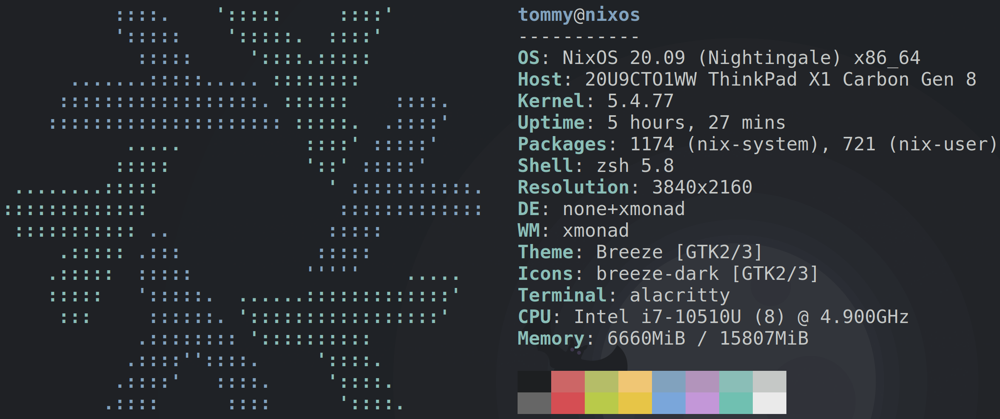

# nix-config

<p>
    <a href="https://github.com/tbidne/nix-config/workflows/build/badge.svg?branch=main" alt="build">
        
    </a>
</p>

This repository holds my config in `/etc/nixos/`. The main desktop programs are:

- [xmonad](https://xmonad.org/)
- [Picom](https://github.com/yshui/picom)
- [Polybar](https://github.com/polybar/polybar)
  - [polybar-scripts/openweathermap-fullfeatured](https://github.com/polybar/polybar-scripts/tree/master/polybar-scripts/openweathermap-fullfeatured)
  - [OpenWeather](https://openweathermap.org/)
- [Rofi](https://github.com/davatorium/rofi)

## Betterlockscreen

To set `betterlockscreen` up, run `betterlockscreen -u path/to/wallpaper`. Then it will be usable via the config in `config.hs`.

## Neofetch



## Desktop

The wallpaper is set to whatever is in `$HOME/Pictures/Wallpaper/Current` via `feh` in `config.hs`.


## Flakes

Sometimes have to first build with `nixos-rebuild switch --flake '#'`. I believe this is when we're only the "old nix" and have to do a build to let us use flakes before we can do the "real build". E.g., we must execute:

```nix
nix = {
  package = pkgs.nixFlakes;
  extraOptions = ''
    experimental-features = nix-command flakes
  '';
};
```

After that we can do the real build with `nixos-rebuild switch --flake ''`.

To update `flake.lock`, run `nix flake update --recreate-lock-file`.